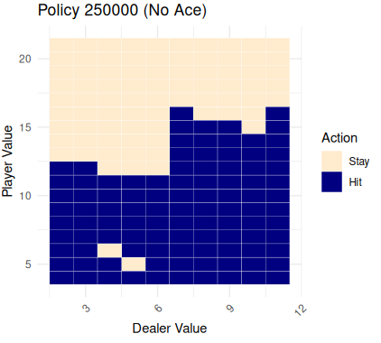
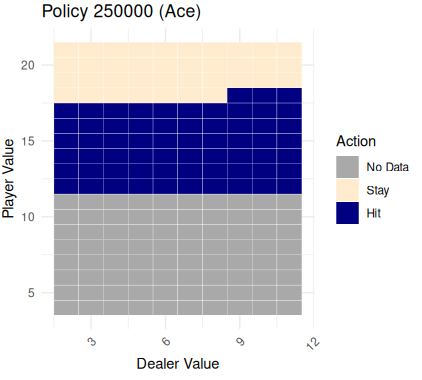

# blackjack-vs-ai

## Agent
The agent is a monte-carlo reinforcement-trained statistical model.  

It was trained on 250,000 episodes using a first-visit monte-carlo training algorithm in R.  

The model achieves a winrate of **43.3%**, up from a random strategy winrate of roughly 28%.  

A winrate >50% is impossible in Blackjack as the game has a house edge. Card values were properly weighted to simulate a real deck of cards when hitting, but states were generated randomly to improve training distribution.  

Some additional explanations for a lower winrate include:
* Agent cannot Split, Double, Surrender, etc.  
* Agent wins 1:1 on Blackjack as opposed to a typical 3:2  
* Agent cannot count cards  

### Agent Strategy Heat Map



### Environment
The model processes states as a vector containing 3 integers:  
* Dealer shown card, 2:11  
* Player value, 4:21  
* Player has soft ace, 1:2  

Note: player ace is 1:2 and not 0:1 as R begins indexing at 1, however it fundamentally represents a boolean. 

### Action Space
The model is capable of taking two actions:  
* Stay, 1  
* Hit, 2  

It is possible the model could achieve a higher winrate with more actions i.e. Split, Double, Surrender, etc.  
However this would greatly increase the model complexity.  

### Reward & Value Function
The model was rewarded as follows:  
* Player win, 1  
* Tie, 0  
* Dealer win, -1  

Blackjack is 1:1.  

The value function used a running average of all rewards to track the expected value of a state and action.  

### Gamma Reward Decay
As the model is trained each episode, it accumulates an average reward moving backwards in time throughout the episode. The gamma (γ) function defines how much long-term rewards should be devalued compared to short term rewards.  

γ usually lies between 0-1.  

A blackjack hand is won only through the final outcome, as such long term outcomes are very important to the weighting of a reward.  

Thus, γ = 1 was used.

### Epsilon Explore vs Exploit
Epsilon (ε) defines the probability for the agent to explore (use random strategy) rather than exploit (use current highest expected value) when deciding any given action.  
P(explore) = ε  
P(exploit) = 1 - ε  

For this model, the best results were achieved with a large starting ε that decays as time progresses. Additionally, given some states are trained more often than others (i.e. s = [10, 20, 1] is much more common than s = [2, 4, 1]), it is wise to decay epsilon uniquely for each state.  

As such, ε was calculated as the starting ε value (ε = 1) multiplied by 100 over (100 + (visits to current state / |action space|)):  
```
epsilon = epsilon_start * (100 / (100 + avg_visits))
```  

ε was taken as 1 to incentivise early exploration, rather than exploit an arbirtary policy.

### Improving the Model
Throughout training, a major roadblock was achieving sufficient training for the less likely to occur states. A partial solution to this was removing the weighting of card distribution that occurs in a natural deck, since face cards all have a value of 10. To achieve this, random states were generated in each episode without any card weighting. This improved training results and reduced training times.

Additional measures to be taken would be to deliberately focus on states with less visits, or take the average of multiple models.  

It should be noted, however, that the less likely states are also less likely to occur in a real game, and thus affect winrate to a lower degree. This means training the model with real states may yield less pretty results, but also uses the time more effectively to achieve the highest possible winrate in the shortest number of episodes.  